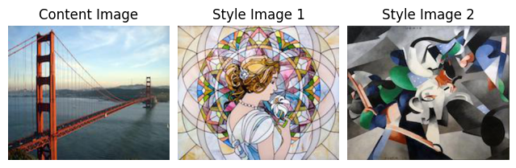
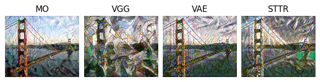
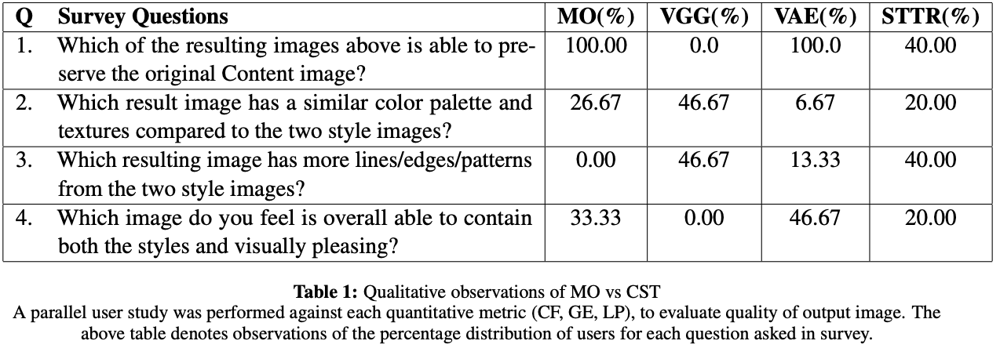
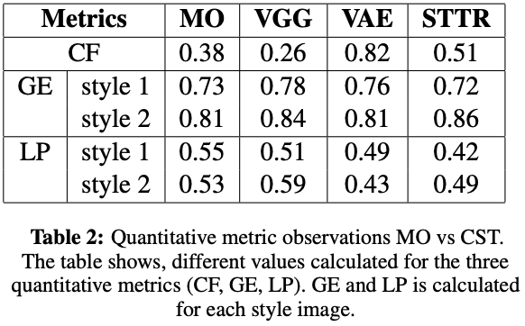
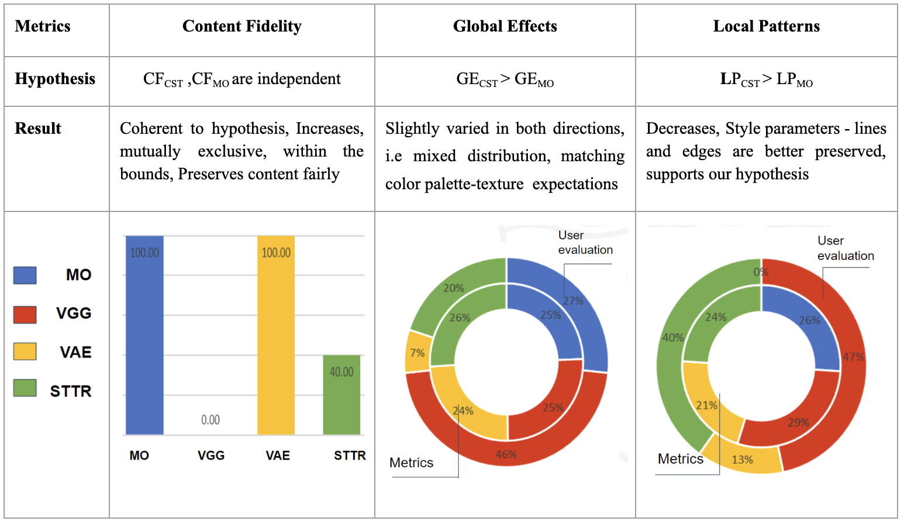

# Extensions to Neural Style Transfer

Course project in [CSCI566](https://csci566-spring2023.github.io/) (Deep Learning and Its Applications) of team __4D Tensor__ in Spring 2023 semester at the University of Southern California(USC).

__Team Members:__ Neha Chawla, Sneha Bandi, Swarnita Venkatraman, Praveen Iyer<br>
__Guiding TA:__ [Bingjie Tang](https://bingjietang718.github.io/) <br>
__Professor:__ [Jesse Thomason](https://jessethomason.com/)

Contributions:
1. Multiple Style Transfer (MST) using Cascade Style Transfer (CST).
2. Quantitative Evaluation metrics with PyTorch implementation and Qualitative Evaluation for Neural Style Transfer (NST).

## Models Explored

Serial Style Transfer (SST) was the chosen method to implement CST. The content image, style 1 image, style 2 image were fixed and the architecture 2 were fixed in our experiments. Additionally, the baseline was fixed as the Multi-Objective Network (MO) which is also implemented in this repository.


*Baseline for Multiple Style Transfer using MO model*


*Three different models explored as Architecture 1 in SST*

### Model 1: Gram Matrix with pretrained 248 VGG-19
The traditional Gram Matrix model with pretrained VGG-19 backbone (as seen in the [original NST paper](https://arxiv.org/abs/1508.06576)) was connected serially two times, as both architecture 1 and 2. The stylistic characteristics of style 1 were replaced by the stylistic characteristics of style 2 on the content image. Results obtained were not promising.

### Model 2: Variational AutoEncoder (VAE)
ST-VAE (Style Transfer VAE) is a VAE model used as architecture 1, combined with the gram matrix model as architecture 2 for latent space-based style transfer. This method allows for multiple style transfer by projecting nonlinear styles to a linear latent space, enabling the merging of styles via linear interpolation before transferring the new style to the content image (as shown in the [paper](https://arxiv.org/abs/2110.07375)). Compared to baseline methods, ST-VAE is faster and more flexible for multiple style transfer. The existing code for single and multiple style transfer was modified to focus on using two style images for the project goals, and it showed promising results when implemented separately. The SST investigation showed that the ST-VAE method, when compared to the gram matrix model connected serially twice, produced promising results.

### Model 3: STyle TRansformer (STTR)
A Vision Transformer model (architecture 1) and the gram matrix model (architecture 2) were used in SST. The STTR network proposed in (as shown in the [paper](https://arxiv.org/abs/2210.05176)) was used to address the issue of destroying spatial information during global feature transformation in style transfer. The STTR network breaks down both content and style images into visual tokens to enable fine-grained style transformation based on attention mechanism (as shown in the [paper](https://arxiv.org/abs/2105.14576)). It showed promising results for single style transfer and was combined with the gram matrix model in serial to investigate its properties for combining multiple style images in SST.

## Evaluation
### Quantitative Evaluation
We implemented three metrics (as discussed in the [paper](https://www.sciencedirect.com/science/article/abs/pii/S1077314221000473)) from scratch to incorporate them into the existing code base for result evaluation. Creating an efficient implementation for local patterns was particularly challenging as it involved generating and comparing all pairs of patches in two images. For greater details on the implementation, you can refer page 4 and 5 of the [report](documentation/6_CSCI566_Final_Project_Report.pdf)

The 3 metrics implemented:
1. __Content Fidelity__: Extent of preservation of content from the content image.
2. __Global Effects__: Average of Global Colors and Holistic Textures with respect to the style image.
    1. __Global Colors__ is the similarity of the color histograms of the 2 images.
    2. __Holistic Textures__ is the similarity of the overall textures of the 2 images.
3. __Local Patterns__: Average of Local Patterns 1 and Local Patterns 2 with respect to the style image.
    1. __Local Patterns 1__ is the measure of how well have the local patterns (lines and edges) been transferred.
    2. __Local Patterns 2__ is the measure of how diverse the transferred patterns are.
### Qualitative Evaluation
Our user study was conducted using Google Forms, which was designed based on TA feedback, and targeted technical users. The study attracted over 30 responses where four questions were asked. The results obtained from the user study are presented in the results section of our slides and validated our calculated quantitative metrics. The overall qualitative results showed resonance with our numerical data, confirming the reliability of both our user study and our data.

The 4 questions asked were:
1. Which of the resulting images above is able to preserve the original Content image? (Content Fidelity)
2. Which result image has a similar color palette and textures compared to the two style images shown above? (Global Effects)
3. Which resulting image has more lines/edges/patterns from the two style images show above? (Local Patterns)
4. Which image do you feel is overall able to contain both the styles and visually pleasing? (Overall Quality)

We permitted users to choose multiple responses for the first question related to Content Fidelity, as our initial assumption was that the variables were independent in both architectures. For the other questions, we opted for a single option as our aim was to determine the relative ordering of output images for each metric.

## Results





## Implementation
An Anaconda environment can be created for running all the codes in this program. The environment can be created by running the following command and passing the ```nst.yml``` file:
```conda env create -f nst.yml```
The primary file for this repository is ```neural_style_transfer.py``` to which we can pass arguments. We can pass the content and style images to use along with their weights. The default values are the ones that were used for the generation of the results displayed in this README file.

For the architecture value, the user can chose one of ```mo-net```, ```cascade-net```,```cascade-net_vae```,```single-style-transfer``` (will be used for single style transfer as it is needed for STTR model)

The STTR model has not been integrated with the above file and has a slightly different running mechanism. First, style 1 has to be transferred using the file ```transformer_nst.py``` where sample commands to run the script have been addede as comments on top of the file. Next, the output of the STTR is used as the input to the ```single-style-transfer``` architecture in ```neural_style_transfer.py``` by changing the content image to the appropriate image.